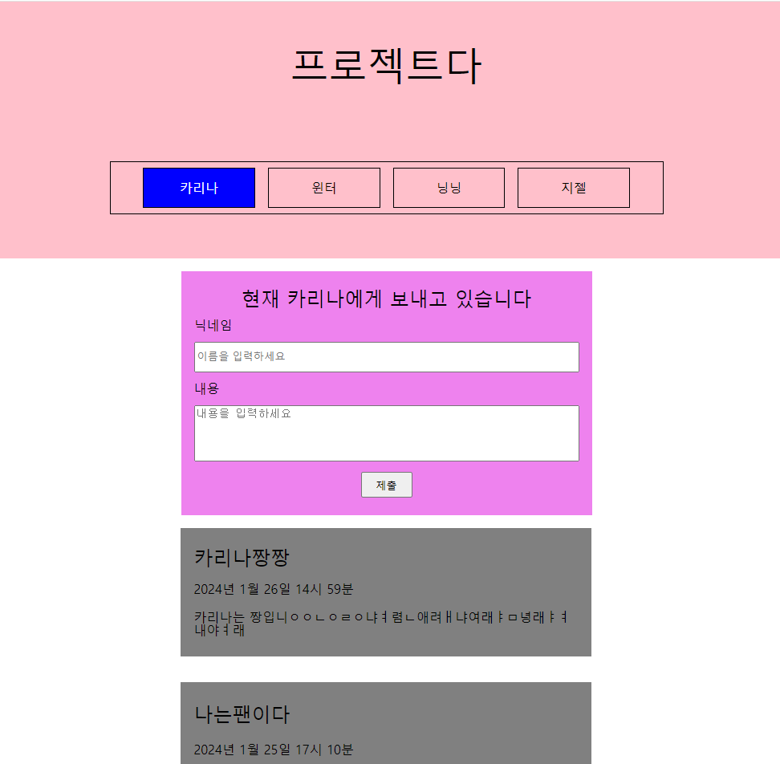
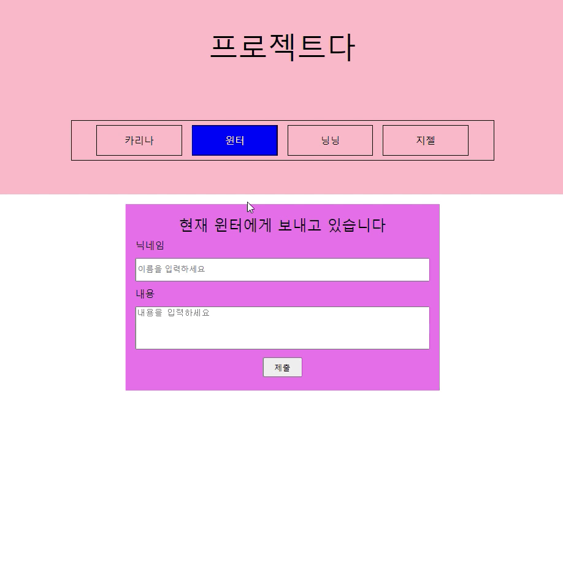
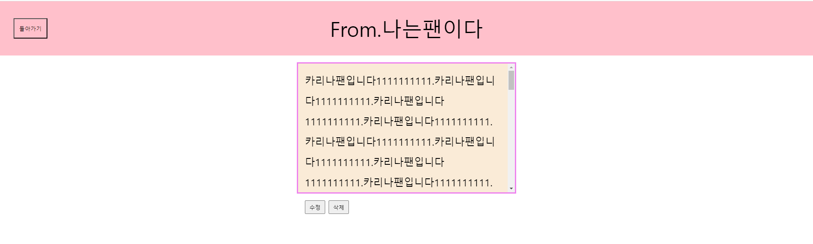
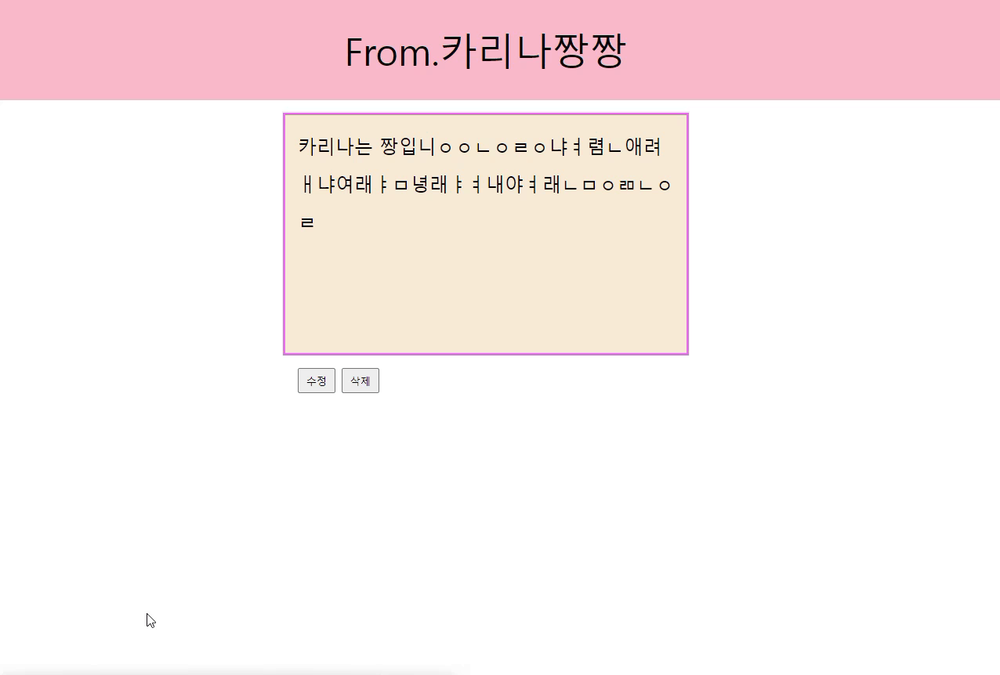
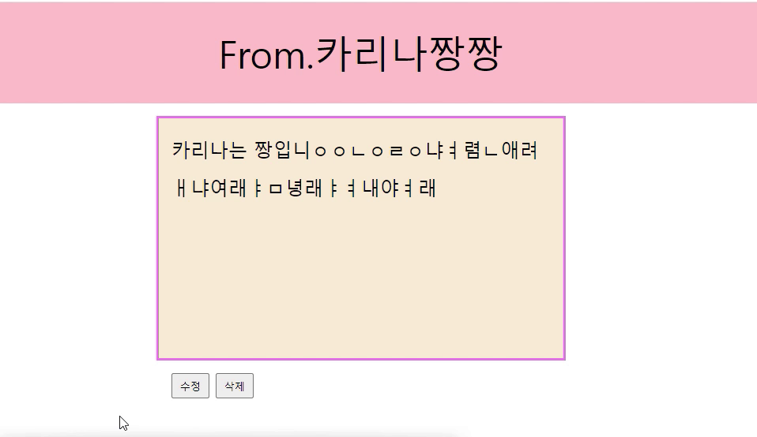

# 내배캠 리액트 두번째 개인 프로젝트

## 🖥️ 프로젝트 소개

- 주제 : 팬레터 사이트 만들기
- 기간 : 24.01.25. ~ 24.02.01(3일)
- 주소 : https://picoloman6.github.io/nbc_react_2_fan_letter/
- 로컬 : firestorage key로 .env 생성 -> yarn dev

## ⚙️ 개발 환경

- FE : TypeScript, React, react-router-dom, redux, stitches, dotenv
- 배포 : vite, Github Actions
- 서버 : firebase firestorage

## 🍿 프로젝트 화면 구성 및 기능

- 메인 화면
  

- 메인 화면에서 팬레터 추가
  

- 메인 화면에서 상세 화면으로 이동
  

- 상세 화면
  

- 상세 화면에서 팬레터 삭제
  

- 상세 화면에서 팬레터 수정
  

## 📁 컴포넌트 파일 구성

- App.tsx : 최상단 컴포넌트
  - Main.tsx : 메인 화면
    - Header.tsx : 메인화면 헤더
      - SelectArea.tsx : 멤버 변경
    - MainForm.tsx : 메인화면 입력창, 팬레터 작성
    - FanLetter : reduce로 팬레터 반복 렌더링
  - Detail.tsx : 상세 화면
    - DetailHeader.tsx : 상세화면 헤더, 이전 페이지 이동
    - DetailLetter.tsx : 팬레터 상세 정보 표시
    - DetailUpdateArea.tsx : 팬레터 수정
    - DetailBtns : 팬레터 수정 및 삭제 버튼

## 📝 KPT 회고

### Keep (유지하고 싶은 좋았던 점)

- TS 환경에서 redux에 thunk 미들웨어를 적용하고 API 비동기 코드 분리
- 더욱 세분화된 타입 적용(ex. string -> '카리나' | '윈터' | '닝닝' | '지젤')
- stitches의 variants를 활용한 조건부 스타일링 구현
- useState를 활용한 수정 컴포넌트 구현
- input과 label을 html-for로 연결

## Problem (아쉬웠던 점)

- 부족한 컴포넌트 파일 구조화(Main과 Detail의 컴포넌트 쪼개는 단위가 다름)
- 부족한 컴포넌트 재사용(페이지별로 헤더, 버튼 등 각각 구현)
- react-router-dom의 browserRouter를 사용해 번들 시 정상적으로 라우팅되지 않는 문제 발생

## Try (Problem 해결 방법, 앞으로의 다짐 등)

- 공통 컴포넌트를 만들어 재사용성 높이기(컴포넌트 디자인 패턴 찾아보기)
- redux 대신 react-query로 API 비동기 코드 처리하기
- 비제어 컴포넌트 사용해보기
- 메모이제이션 더 적극적으로 사용하기
